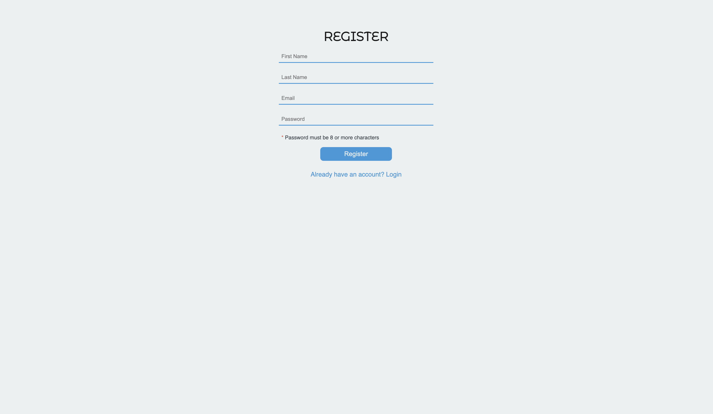
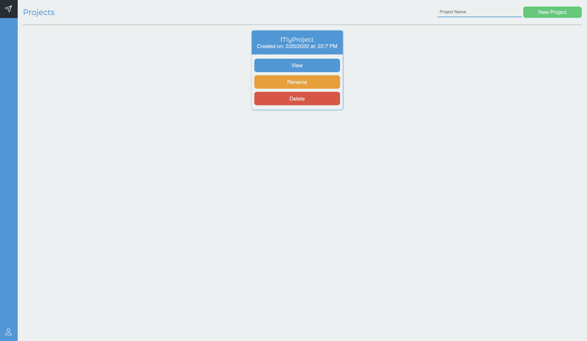
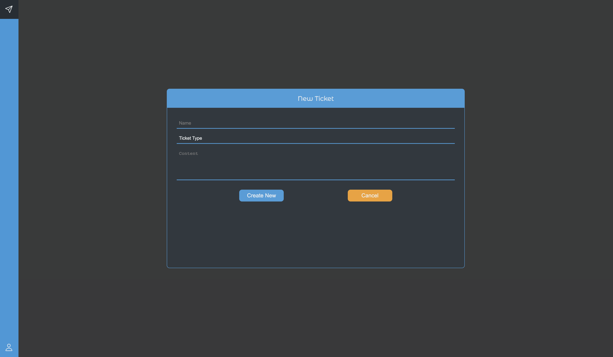
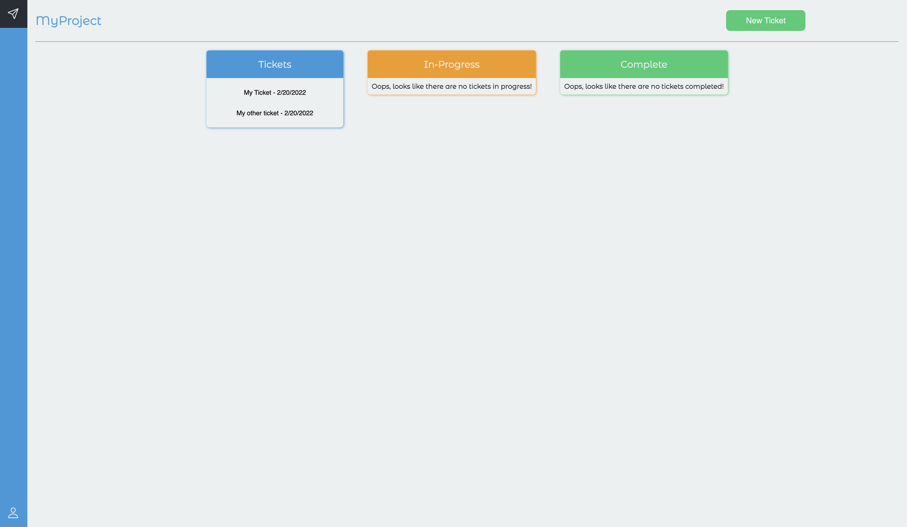

<p align="center">
	
</p>

# TicketIT-WEB
(WEB) ReactJS front-end for TicketIT app.

---

<p align="center">
	
	
	
	
	
</p>

---

## Getting Started

Clone:

```git
git clone https://github.com/KleoHasani/TicketIT-WEB.git
```

Install dependencies:

```npm
npm install
```

Run:

```npm
npm start
```

### Required

- Node v15.2.0 or above

- NPM 6.14.11 or above

### Build With

React

```npm
npm run build
```

## Version

v1.0.0

## Authors

Kleo Hasani

### Notes
